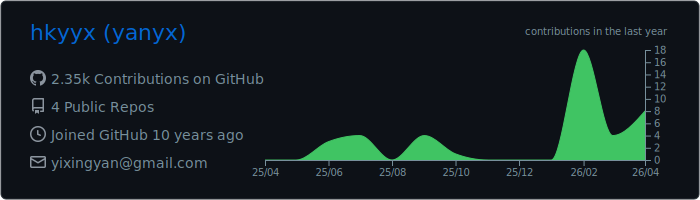
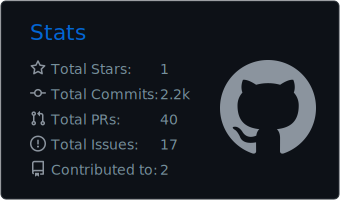
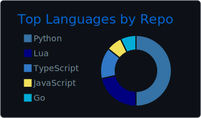

<h1 align="left">Hi, I'm Hank Yan <code>yanyx</code></h1>

Cloud infrastructure and SRE engineer based in Shanghai, China. I build reliable platforms, Kubernetes operations workflows, and AI-assisted incident response systems.

### What I work on

- Kubernetes / EKS operations, platform reliability, and production troubleshooting
- AWS infrastructure, Bedrock AgentCore, MCP integrations, and operational automation
- Alertmanager-driven incident triage, runbook-backed diagnosis, and safe remediation paths
- Infrastructure-as-code, release pipelines, documentation, and developer-facing operational tools

### Current focus

- Building SRE agents that analyze alerts before humans jump into an incident
- Connecting Kubernetes, AWS, and runbook evidence through controlled tool access
- Keeping automation useful, auditable, and boring in the best possible way
- Turning hard-won operational lessons into reusable docs, scripts, and workflows

### Tech I use often

AWS · Kubernetes · Python · TypeScript · Shell · Docker · Terraform · Jsonnet · PostgreSQL · Redis

### GitHub snapshot

  

  
  

### Contact

Shanghai, China · yixingyan@gmail.com
